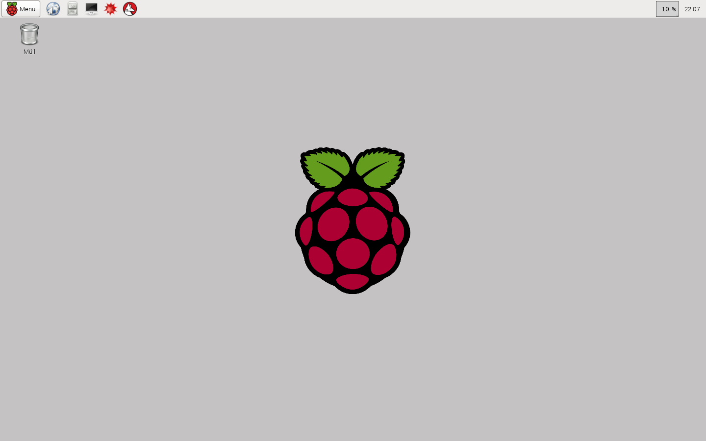

### Remote pi control

This Tutorial disciples how to connect your raspberry pi with your PC.

#####Remote GUI connection

1.  Install RDP on your Raspberry Pi

        sudo apt-get install xrdp

2.  Install remote desktop client on your PC

    On Windows you have got already a remote desktop control program simply searching for "remote desktop" and you will find it.  
    In the upcoming window put in the IP of your raspberry pi and try it (Maybe it will not work first time but try it again sometimes it works on second or third time)  
  

####Remote console
  
* There is also a second method called SSD Connection and you need the program [putty](http://www.putty.org/) on your pc

---

This project is licensed under a [**Creative Commons Attribution-NonCommercial-ShareAlike 4.0 International License**](http://creativecommons.org/licenses/by-nc-sa/4.0/)

###The source code is licensed under the MIT License (MIT)

Copyright (c) 2015 Johannes Leick

Permission is hereby granted, free of charge, to any person obtaining a copy of this software and associated documentation files (the "Software"), to deal in the Software without restriction, including without limitation the rights to use, copy, modify, merge, publish, distribute, sublicense, and/or sell copies of the Software, and to permit persons to whom the Software is furnished to do so, subject to the following conditions:

The above copyright notice and this permission notice shall be included in all copies or substantial portions of the Software.

THE SOFTWARE IS PROVIDED "AS IS", WITHOUT WARRANTY OF ANY KIND, EXPRESS OR IMPLIED, INCLUDING BUT NOT LIMITED TO THE WARRANTIES OF MERCHANTABILITY, FITNESS FOR A PARTICULAR PURPOSE AND NONINFRINGEMENT. IN NO EVENT SHALL THE AUTHORS OR COPYRIGHT HOLDERS BE LIABLE FOR ANY CLAIM, DAMAGES OR OTHER LIABILITY, WHETHER IN AN ACTION OF CONTRACT, TORT OR OTHERWISE, ARISING FROM, OUT OF OR IN CONNECTION WITH THE SOFTWARE OR THE USE OR OTHER DEALINGS IN THE SOFTWARE.
